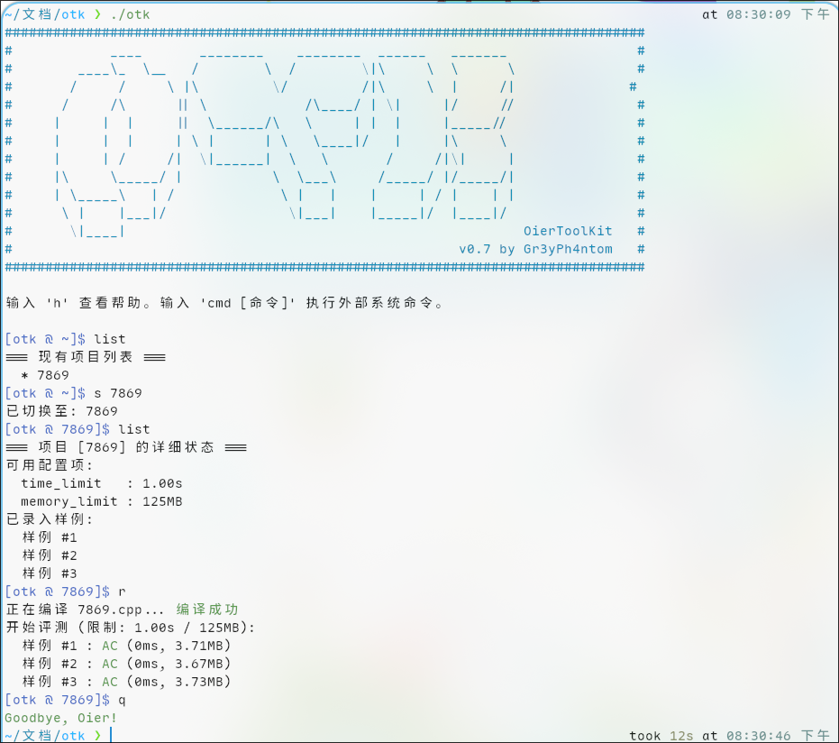

# OierToolKit (otk)

一个为 Oier 量身定制的轻量级 Linux 本地评测姬与题目管理工具。
~~叫做OierOperationSimplifier更合理吧。。~~

## 🌟 Features
* **清爽控制界面**：内嵌交互式 Shell，赏心悦目的彩色输出。
* **时空精准监控**：借由 GNU time 抓取高精度运行时间（ms）与最大常驻内存（MB）。
* **智能 Diff 引擎**：WA（Wrong Answer）时自动对比标准输出与你的输出差异。
* **命令穿透**：通过 `cmd` 快捷执行 Linux 系统命令。
* 总之就是很流畅啦～

## 🚀 Installation
1. clone本项目并确保系统安装了GNU工具集并包含 `g++` 与 `time` 命令。
2. 运行 `go build -o otk`

**(C)opyright 2026 魇珩Gr3yPh4ntom. All rights reserved.**

本工具依据 **GNU General Public License v3.0 (GPLv3)** 开源协议免费分发与修改，详情参见仓库下LICENSE文件。
